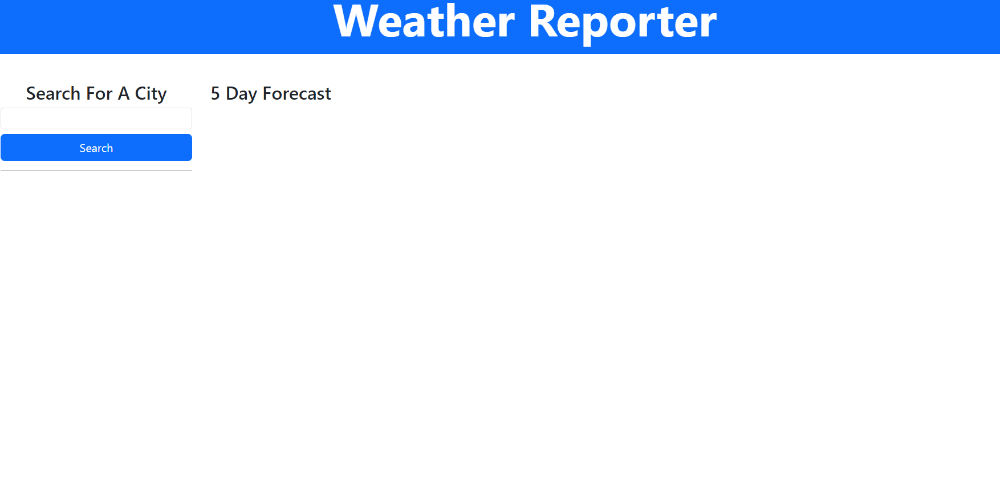
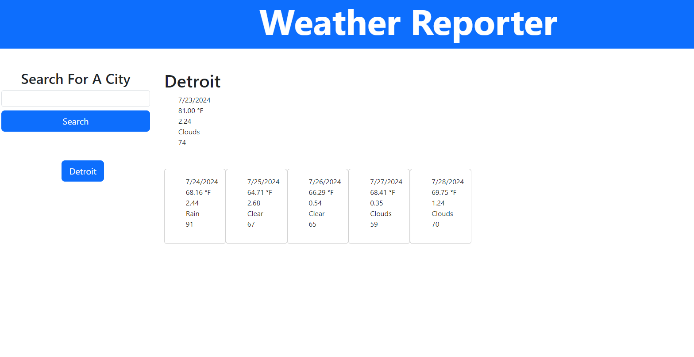

# Weather Reporter

## DESCRIPTION
This is a simple page that reports the weather based on a city search. It will display the current weather and then display the weather for that same city for the next five days.

## INSTALLATION
The application does not need installation but is available for use at <a href=""></a> 

## USAGE


To use the application, enter the name of a well known city in the search box and hit search. 



Previous searches will appear in below the search bar. While the results of the current search will appear to the right. To view a prior search's weather, just click on the city name.


## CHALLENGE REQUIREMENTS

### User Story

```
AS A traveler 
I WANT to see the weather outlook for multiple cities 
SO THAT I can plan a trip accordingly 
```

### Acceptance Criteria

```
GIVEN a weather dashboard with form inputs 
WHEN I search for a city 
THEN I am presented with current and future conditions for that city and that city 
is added to the search history 
WHEN I view current weather conditions for that city 
THEN I am presented with the city name, the date, an icon representation of 
weather conditions, the temperature, the humidity, and the wind speed 
WHEN I view future weather conditions for that city 
THEN I am presented with a 5-day forecast that displays the date, an icon 
representation of weather conditions, the temperature, the wind speed, and the 
humidity 
WHEN I click on a city in the search history 
THEN I am again presented with current and future conditions for that city
```

## CONTACT INFORMATION
<strong>Name:</strong> Aaron Allen  
<strong>Email:</strong> aaronseth.allen@gmail.com 

